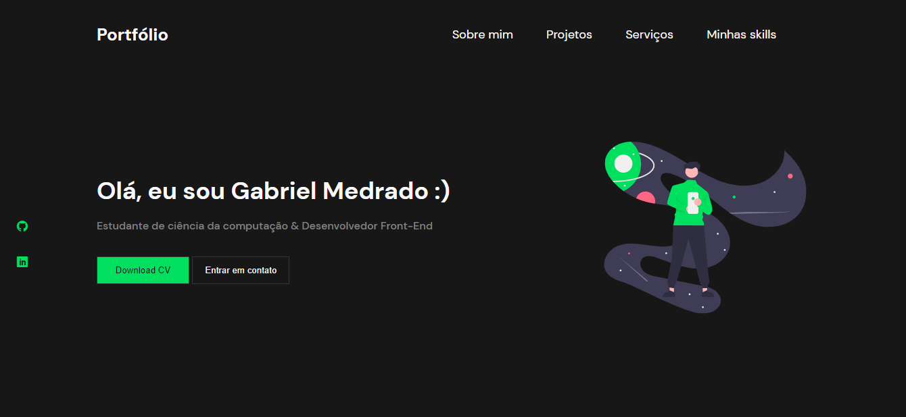

## Portfolio
### Layout 🚧
  
  

    <a href="#projeto-">Projeto</a> &nbsp;&nbsp;&nbsp;|&nbsp;&nbsp;&nbsp;
    <a href="#tecnologias-">Tecnologias</a> &nbsp;&nbsp;&nbsp;|&nbsp;&nbsp;&nbsp;
    <a href="#layout-">Layout</a> &nbsp;&nbsp;&nbsp;|&nbsp;&nbsp;&nbsp;
    <a href="#licença-%EF%B8%8F">Licença</a>

## Projeto 💻
- Design Criado por Yuri Silva
- Site para divulgaçao - https://gbmedrado.netlify.app/

## Tecnologias 🛠

  
  
  

## Licença ⚖️
This project is under the MIT license. See the archive [LICENSE]() for more details.

## Autor ✍🏾

| <a  href="https://github.com/gabrielmedrados/"> Gabriel Medrado</a>|
| :---: |
 

